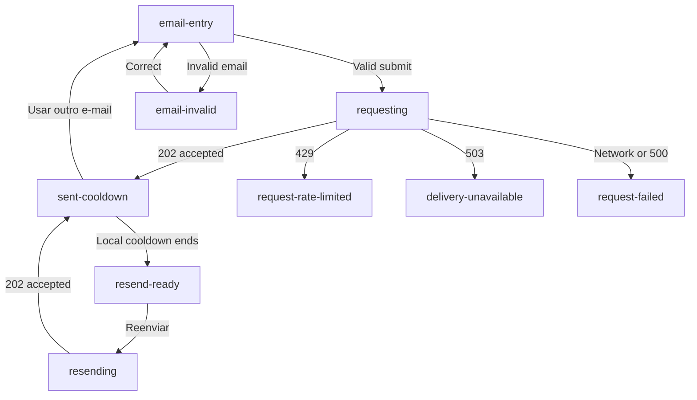
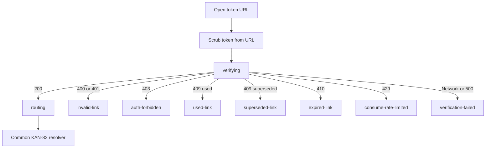

# Sandicts Magic Link Authentication Prototype

## Purpose

Define the implementation-ready UX direction for the Sandicts MVP magic-link
flow: email entry, request progress, sent confirmation, resend, request failure,
token verification, terminal link outcomes, and successful post-login handoff.

This artifact implements the KAN-104 prototype and documentation scope. It does
not call the API, send email, consume a real token, create a session, change the
backend contract, or add production React components.

The prototype reuses the public-shell and authentication anatomy selected by
KAN-84 while keeping magic-link-specific state and copy in a separate artifact.

## View The Prototype

Open [`index.html`](./index.html) directly or serve the repository and navigate
to:

```txt
/docs/frontend/prototypes/auth-magic-link/index.html
```

Each state is directly addressable:

```txt
?state=email-entry
?state=sent-cooldown
?state=expired-link
?state=verification-failed&long=1
?state=routing
```

The toolbar changes only the prototype state. Form submissions and buttons
simulate transitions without making network requests or persisting an email or
token.

## Status And Authority

| Source | Authority |
| --- | --- |
| `index.html`, CSS, and JavaScript | KAN-104 layout, state composition, and responsive direction |
| This document | KAN-104 state semantics, copy, actions, privacy, and implementation handoff |
| KAN-84 auth sign-in prototype | Shared `/sign-in` public shell, Google presentation, session-expired feedback, auth-forbidden boundary, and post-login composition |
| KAN-81 expired-session decision | Session-expiry classification, copy, safe `returnTo`, and history behavior |
| KAN-82 post-login routing decision | Provider-independent destination resolution after successful consumption |
| KAN-144 visual foundation | shadcn preset, Stone/Amber tokens, IBM Plex Sans, Montserrat, Phosphor, radius, and shared static token artifact |
| KAN-145 brand assets | Canonical scorpion mark and wordmark; KAN-104 references the shared asset path and does not fork logo artwork |
| Backend OpenAPI | Request and consume HTTP status and error-code contract |
| Generated Orval client | Typed frontend transport functions and error unions |

If visual composition and API semantics disagree, keep the API mapping intact
and update the prototype. Do not infer a new response code from copy.

## Dependency Decisions Preserved

### KAN-81: Expired Session

- An expired magic link is not an expired authenticated session.
- `magic_link_expired` never uses `Sua sessão expirou`.
- Reauthentication after a confirmed session expiry can use email entry inside
  the same `/sign-in` surface.
- The persistent session-expired alert remains visible until authentication
  succeeds or the user leaves sign-in.
- A safe `returnTo` is reauthorized after magic-link consumption.

### KAN-82: Post-Login Routing

- Requesting or resending a link does not authenticate and does not route.
- Successful consumption hydrates the same session snapshot as Google.
- The token-bearing route is removed from browser history with replace
  behavior.
- The provider-independent resolver owns `returnTo`, Player onboarding, context
  fallback, context picker, and no-context outcomes.
- Magic link never selects a destination itself.

### KAN-83: Google One Tap

- The `/sign-in/magic-link` consumption route is ineligible for One Tap.
- Verification, link-error, and terminal auth boundaries never mount One Tap.
- Explicit Google remains an alternative on ordinary `/sign-in` entry and
  request-recovery states where another sign-in method is safe.

### KAN-84: Shared Sign-In

- The shared surface is a dedicated `/sign-in` page in the Public shell.
- Google remains first, followed by a neutral
  `ou continue por e-mail` divider and email entry.
- Both methods remain visible rather than using tabs.
- Compact, medium, and expanded layout anatomy is reused.
- Magic-link request and consume states remain owned by this artifact.

## Selected UX Decisions

### Method Composition

Use one shared `/sign-in` container:

1. official Google control footprint
2. neutral divider `ou continue por e-mail`
3. email field and `Enviar link` action

This keeps every available method visible, preserves the established Google
hierarchy, and avoids route, focus, analytics, and error-state duplication.

### Sent Confirmation And Email Privacy

The confirmation does not repeat or mask the submitted email in visible copy.
It refers to `o endereço informado` and offers `Usar outro e-mail`.

The value may remain in component memory only while the current page is active.
It is not added to the URL, copy, storage, analytics payload, or prototype
catalog.

### Resend

- A successful request enters a local 60-second cooldown.
- The cooldown prevents accidental duplicate submission but is not a security
  control.
- After the cooldown, `Reenviar link` calls the same request endpoint.
- Every accepted resend resets the local cooldown.
- The backend remains authoritative for the real request limit.
- A newer accepted request makes older active links superseded.
- Confirmation copy tells the user to use the most recent email after resend.

### Rate Limit

Do not show an authoritative countdown for `429 rate_limited`. The current API
body has no retry timestamp and the frontend error wrapper does not preserve a
typed cooldown signal.

The state:

- removes immediate resend or consume retry
- says to wait without promising an exact duration
- offers explicit Google or a safe Public destination when appropriate
- never derives UX timing from a backend implementation constant

### Token Cleanup

On the consumption route:

1. parse and validate the query shape
2. keep the raw token only in transient memory
3. immediately replace the token-bearing URL with clean
   `/sign-in/magic-link`
4. start the consume request
5. keep the clean route for failure recovery
6. replace-navigate through the common post-login resolver after success

Refreshing a cleaned failure route requires a new link. This tradeoff is
preferred over leaving a reusable secret in history, screenshots, referrers, or
copied URLs.

### Success

Do not add an artificial success delay. A successful consume moves directly to
the non-interactive `routing` state:

- title: `Preparando sua área`
- description:
  `Seu acesso foi confirmado. Estamos verificando o destino disponível.`
- status: `Preparando sua área…`

The resolver, not this screen, chooses the destination.

### Link Lifetime Copy

Do not hardcode `15 minutos` in the in-app request confirmation. The OpenAPI
response exposes only `status: accepted`, not the challenge expiry.

Transactional email content may communicate the concrete expiry it receives
from the backend. If an exact in-app lifetime becomes necessary, add it to a
future typed API contract rather than duplicating configuration in copy.

## API Contract

### Request

`POST /auth/magic-link/request`

Body:

```json
{
  "email": "player@example.com"
}
```

The backend trims and lowercases the value. The success response is deliberately
generic:

```json
{
  "status": "accepted"
}
```

| HTTP | Code | UX state |
| --- | --- | --- |
| `202` | success | `sent-cooldown` |
| `400` | `validation_error` | `email-invalid` |
| `429` | `rate_limited` | `request-rate-limited` |
| `503` | `email_delivery_unavailable` | `delivery-unavailable` |
| `500` | `internal_error` | `request-failed` |
| no response | network/timeout | `request-failed` |

The success state must be identical regardless of whether an account existed
before the request. Copy never says that an account was found, created, linked,
blocked, or eligible.

### Consume

`POST /auth/magic-link/consume`

Body:

```json
{
  "token": "transient-token-from-url"
}
```

| HTTP | Code | UX state |
| --- | --- | --- |
| `200` | success | `routing` |
| `400` | `validation_error` | `invalid-link` |
| `401` | `invalid_magic_link_token` | `invalid-link` |
| `403` | `account_auth_forbidden` | `auth-forbidden` |
| `409` | `magic_link_already_used` | `used-link` |
| `409` | `magic_link_superseded` | `superseded-link` |
| `410` | `magic_link_expired` | `expired-link` |
| `429` | `rate_limited` | `consume-rate-limited` |
| `500` | `internal_error` | `verification-failed` |
| no response | network/timeout | `verification-failed` |

The success response hydrates `account`, `session`, `accessToken`, and
`accessTokenExpiresAt`. The refresh token remains in the backend-owned HttpOnly
cookie and never appears in frontend copy or storage.

## State Inventory

### Entry And Request

| State | Meaning | Primary recovery |
| --- | --- | --- |
| `email-entry` | Ordinary shared sign-in entry | Submit a valid email |
| `session-expired-entry` | KAN-81 alert plus both reauthentication methods | Submit email or use Google |
| `email-invalid` | Client or server validation rejected email input | Correct the field |
| `requesting` | Request mutation is pending | Wait; duplicate actions disabled |
| `sent-cooldown` | Generic confirmation with local resend cooldown | Check inbox or use another email |
| `resend-ready` | Local cooldown ended | Request another link |
| `resending` | Resend mutation is pending | Wait; duplicate actions disabled |
| `request-rate-limited` | Request endpoint returned `429` | Wait or use another sign-in method |
| `delivery-unavailable` | Email delivery returned `503` | Retry manually or use Google |
| `request-failed` | Network, timeout, or `500` left the result unconfirmed | Check connection, then retry manually |

### Consume

| State | Meaning | Primary recovery |
| --- | --- | --- |
| `verifying` | Clean callback route is consuming the transient token | Wait |
| `invalid-link` | Token is absent, malformed, or unknown | Request a new link |
| `expired-link` | Challenge lifetime ended | Request a new link |
| `used-link` | Token was already consumed | Request a link for this device |
| `superseded-link` | A newer request revoked this token | Use the newest email or request another |
| `consume-rate-limited` | Consume endpoint returned `429` | Wait; no immediate token replay |
| `auth-forbidden` | Account cannot authenticate | Use another account or leave sign-in |
| `verification-failed` | Network, timeout, or `500` interrupted verification | Retry manually in this runtime or request a new link |
| `routing` | Session succeeded and the common resolver is running | No interaction |

## State Flow





## Copy And Actions

Use Brazilian Portuguese that:

- starts with the user-visible result
- explains one consequence
- names one safe next step
- avoids account-existence claims
- distinguishes link expiry from session expiry
- avoids backend, provider, token, database, request-ID, or security-policy
  terminology

| State | Title | Description | Primary action |
| --- | --- | --- | --- |
| Entry | `Entre para continuar` | `Use Google ou receba um link seguro no seu e-mail.` | `Enviar link` |
| Sent | `Confira seu e-mail` | `Se o endereço informado estiver correto, você receberá um link para entrar. Ele pode levar alguns instantes.` | Inbox guidance |
| Resend ready | `Confira seu e-mail` | `Se solicitar outro link, use o e-mail mais recente que receber.` | `Reenviar link` |
| Request rate limit | `Muitas tentativas` | `Aguarde um pouco antes de solicitar outro link.` | Alternative method |
| Delivery unavailable | `Não foi possível enviar o link agora` | `O envio por e-mail está temporariamente indisponível. Tente novamente em alguns instantes.` | `Tentar novamente` |
| Invalid | `Este link não é válido` | `Solicite um novo link para entrar com segurança.` | `Solicitar novo link` |
| Expired | `Este link expirou` | `Solicite um novo link para continuar.` | `Solicitar novo link` |
| Used | `Este link já foi utilizado` | `Para entrar neste dispositivo, solicite um novo link.` | `Solicitar novo link` |
| Superseded | `Há um link mais recente` | `Use o e-mail mais recente que recebeu ou solicite outro link.` | `Solicitar outro link` |
| Verification rate limit | `Não foi possível verificar agora` | `Aguarde um pouco antes de tentar entrar novamente.` | Safe sign-in return |
| Forbidden | `Você não tem acesso a esta área` | `Use outra conta ou volte para uma área pública do Sandicts.` | `Usar outro e-mail` |
| Verification failure | `Não foi possível confirmar seu acesso` | `Confira sua conexão e tente novamente.` | `Tentar novamente` |
| Routing | `Preparando sua área` | `Seu acesso foi confirmado. Estamos verificando o destino disponível.` | None |

## Loading, Retry, And Command Safety

- Request uses `Enviando…`.
- Resend uses `Reenviando…`.
- Consume uses `Verificando seu link…`.
- Post-login resolution uses `Preparando sua área…`.
- Busy controls preserve geometry and reject duplicate submission.
- Unknown-outcome commands are never replayed automatically.
- Request retry creates a new request only after explicit user action.
- Consume retry reuses the transient in-memory token only after explicit action
  and only while the current runtime still holds it.
- `403` never triggers refresh, resend, or automatic account switching.
- `429` never exposes an immediate retry without a reliable cooldown signal.

## Responsive Direction

### Compact

Below `48rem`:

- keep the compact Public header
- use at least a `1rem` page gutter
- keep introduction and auth surface in one column
- keep Google, divider, email input, and submit action full width
- let the software keyboard reflow the page without fixed-height containers
- use `type=email`, `inputmode=email`, and a visible label
- stack terminal recovery actions
- keep every touch target at least `44px` by `44px`
- allow long Portuguese copy to wrap without truncation

### Medium

From `48rem` to below `64rem`:

- center the introduction and authentication surface
- constrain reading and control width
- preserve the same state order as compact
- avoid modal or side-rail behavior

### Expanded

At `64rem` and above:

- reuse the KAN-84 two-column Public composition
- keep product and recovery context on the left
- constrain the auth surface to approximately `26rem`
- keep methods stacked inside the card
- preserve card width across entry, sent, and terminal states

Validation targets are `320px`, `390px`, `768px`, and `1440px`, compact
landscape, long Portuguese copy, and reflow equivalent to `200%` zoom.

## Visual Foundation

- The document activates the shared dark token map through `html.dark`.
- Base typography, colors, semantic states, and radius come from
  `../shared/sandicts-visual-tokens.css` through the KAN-84 stylesheet.
- The selected preset remains `b6pMnd9eSI`: Nova, Stone/Amber, IBM Plex Sans,
  Montserrat headings, small radius, and Phosphor production icons.
- Magic-link CSS uses semantic status tokens instead of retaining the old
  teal/amber hexadecimal or RGB values.
- KAN-104 references `public/sandicts-mark.svg`; KAN-145 owns replacing that
  centralized asset with the approved scorpion without a local prototype copy.

## Accessibility And Focus

- Keep one page `h1`; the prototype toolbar owns it and the simulated product
  heading is `h2`.
- Use visible labels and `autocomplete=email`.
- On validation failure, keep or move focus to the email field and connect the
  error through `aria-describedby`.
- Announce a new action error assertively.
- Keep initial callback and terminal content in normal reading order without an
  assertive announcement.
- Use `aria-busy` and concise status text for request, resend, consume, and
  routing.
- Remove hidden methods and actions from the focus order.
- Do not move focus into content that immediately unmounts.
- Do not rely on color alone.
- Preserve the shared semantic `ring` focus indicator.
- Respect reduced motion.

## Privacy And Security

- Request success is generic for every valid email.
- Do not branch copy on existing, new, linked, blocked, or disabled account
  state.
- Do not render the submitted email in confirmation copy.
- Keep the email only in transient form state until the user leaves or changes
  the flow.
- Never place email or token in `returnTo`, storage, analytics, logs, or
  prototype state URLs.
- Remove the raw token from browser history before consume.
- Never render raw API `message`, `path`, `requestId`, validation internals,
  provider payload, account ID, session ID, or stack trace.
- Do not name Resend, SMTP, Mailpit, Prisma, rate-limit keys, token hashes, or
  challenge state in user-facing copy.
- Reauthorize `returnTo` before navigation.
- Do not reveal whether a rejected private resource exists.
- The prototype performs no real API or email action.

## KAN-84 Integration

KAN-84 continues to own:

- Public `/sign-in` shell and responsive anatomy
- explicit Google and One Tap fallback presentation
- session-expired alert and auth-level forbidden boundary
- generic post-login routing composition

KAN-104 owns:

- email field and validation
- request and resend progress
- sent confirmation and local resend cooldown
- request rate-limit and delivery-unavailable states
- token verification presentation
- invalid, expired, used, superseded, and consume-rate-limit states
- token cleanup direction
- magic-link-specific copy and recovery

The shared decisions are now closed:

| Integration area | Selected direction |
| --- | --- |
| Container | One `/sign-in` Public-shell container |
| Method order | Google first, email second |
| Divider | `ou continue por e-mail` |
| Email confirmation | No email echo |
| Callback | `/sign-in/magic-link`, One Tap ineligible |
| Success | Clean token URL, hydrate common session, invoke KAN-82 resolver |

Do not add magic-link states to the KAN-84 catalog. Reference this artifact from
the KAN-84 handoff and keep implementation ownership separate.

## Artifact Organization

- `index.html`: semantic prototype structure
- `prototype-magic-link.css`: magic-link form, method stack, sent state, and
  callback additions
- `prototype.catalog.js`: state, copy, actions, API mapping, and grouping
- `prototype.renderers.js`: DOM rendering boundary
- `prototype.js`: query state, toolbar behavior, and simulated transitions
- `e2e/magic-link-prototype.spec.ts`: 19-state, responsive, validation, privacy,
  and recovery regression coverage

The artifact reuses the base CSS files from `../auth-sign-in/` so shared shell,
controls, alerts, boundaries, and KAN-144 visual tokens do not drift.

Production components must use design tokens, shadcn/ui primitives, next-intl,
React Hook Form/Zod where appropriate, and generated API hooks rather than
copying the prototype JavaScript architecture.

## Implementation Handoff

Runtime work remains in dedicated frontend implementation tasks:

- the sign-in page owns shared method composition
- a request hook wraps the generated request mutation
- a consume hook wraps the generated consume mutation
- auth-session mutation handlers hydrate the shared in-memory snapshot
- a callback route owns transient token parsing and cleanup
- the provider-independent resolver owns navigation
- next-intl owns production copy
- Playwright uses backend-owned Mailpit capture for successful email E2E

Do not edit generated OpenAPI client files manually. If the contract changes,
regenerate them through the existing Orval workflow.

## Test And Validation Matrix

### Contract Mapping

- every documented request response maps to one state
- every documented consume response maps to one state
- `400` consume and missing token converge on privacy-safe invalid-link copy
- both `409` codes remain distinguishable
- network and `500` remain unknown-outcome failures

### Request And Resend

- invalid email does not submit
- busy request prevents duplicate submit
- `202` never reveals account existence
- sent confirmation never echoes email
- cooldown prevents immediate accidental resend
- resend resets cooldown and tells the user to use the latest email
- request `429` has no invented countdown
- `503` never names the delivery provider

### Consume

- token is removed from the URL before the pending state
- callback does not mount One Tap
- invalid, expired, used, and superseded links have distinct recovery where
  useful
- `403` uses the auth-forbidden boundary
- consume `429` does not replay the token
- `500` or network failure does not claim the link is invalid or expired

### Success

- `200` hydrates the same session snapshot as Google
- the refresh token remains cookie-only
- routing uses replace behavior
- an authorized `returnTo` is revalidated
- Player onboarding, context picker, no-context, and unauthorized return remain
  KAN-82 outcomes

### Visual And Accessibility

- all states render at `320px`, `390px`, `768px`, and `1440px`
- the document activates `html.dark` and consumes the synchronized KAN-144 token
  artifact
- magic-link-specific CSS contains no superseded foundation colors
- layout survives compact landscape and 200% reflow
- long Portuguese copy wraps without clipping
- keyboard order follows visual order
- validation and action errors use appropriate focus and announcements
- busy and hidden controls expose correct semantics
- touch targets meet the 44px minimum
- reduced motion removes nonessential animation

## Acceptance Checklist

- [x] Email entry, sending, sent confirmation, resend, and request failures are documented.
- [x] Invalid, expired, used, superseded, rate-limited, and forbidden consume states are documented.
- [x] API status and code mappings are exhaustive.
- [x] Recovery actions and copy direction are explicit.
- [x] Enumeration resistance and internal-detail suppression are explicit.
- [x] Mobile, desktop, reflow, focus, and live-region behavior are explicit.
- [x] KAN-81 session-expiry semantics remain distinct.
- [x] KAN-82 owns the successful destination.
- [x] KAN-84 overlap and integration decisions are closed.
- [x] KAN-144 visual tokens and typography are integrated without changing the state model.
- [x] The shared logo asset remains centralized for KAN-145 replacement.
- [x] The prototype is directly reviewable without real authentication.
- [x] Backend, generated client, email templates, and production runtime remain unchanged.
