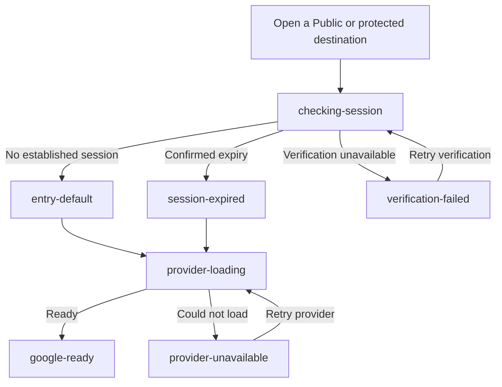
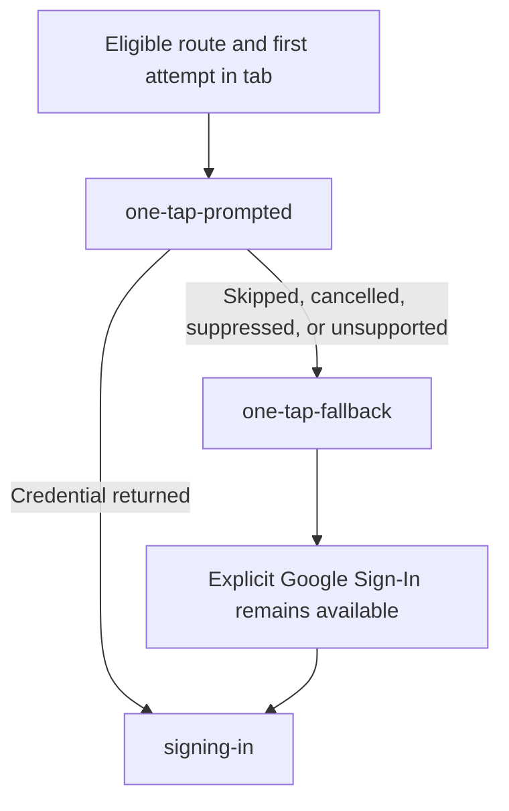
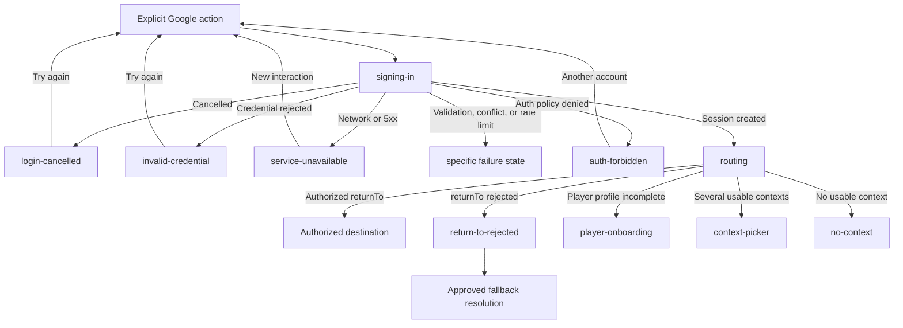

# Sandicts Auth Sign-In Prototype

## Purpose

Define the implementation-ready UX direction for the Sandicts MVP sign-in
surface, explicit Google Sign-In, Google One Tap fallback, expired-session
recovery, authentication failure states, and the immediate post-login handoff.

This artifact implements the KAN-84 prototype and documentation scope. It does
not implement Google Identity Services, create a real session, change the
backend, or add production React components.

The prototype uses a provider-shaped placeholder to represent the footprint of
the official Google button. It does not reproduce, override, or claim ownership
of provider-controlled UI.

## View The Prototype

Open [`index.html`](./index.html) directly or serve the repository and navigate
to:

```text
/docs/frontend/prototypes/auth-sign-in/index.html
```

State and long-copy selections are stored in query parameters:

```text
?state=session-expired
?state=invalid-credential
?state=auth-forbidden&long=1
```

The toolbar changes only the demonstration. Buttons simulate transitions but
do not authenticate or navigate away from the artifact.

## Status And Authority

| Artifact | Status | Authority |
| --- | --- | --- |
| `index.html`, CSS, and JavaScript | KAN-84 prototype direction | Canonical for layout, state composition, and responsive behavior |
| This document | KAN-84 implementation handoff | Canonical for state semantics, copy, action hierarchy, and ownership |
| Google-rendered prompt and button | Provider-controlled runtime UI | Google remains authoritative for final provider rendering |
| Global states prototype | Shared state composition | Canonical for generic loading, error, unauthenticated, and forbidden patterns |
| App shells prototype | Shell and responsive navigation | Canonical for Public, Player, and Organization shell behavior |

When this prototype conflicts with provider policy, the provider policy wins and
the implementation preserves the intent documented here. When it conflicts with
KAN-81, KAN-82, or KAN-83, those dependency decisions win.

## Dependency Decisions Preserved

### KAN-81: Expired Session

- Confirmed expiry replace-navigates to `/sign-in`.
- The page receives a validated internal `returnTo` and
  `reason=session-expired`.
- Expiry feedback is persistent inline content.
- No toast, modal-only treatment, dedicated expiry route, or form-draft
  persistence is introduced.
- Temporary verification failure is not called expired.
- Auth-level and resource-level forbidden remain distinct.

Approved expiry copy:

- title: `Sua sessão expirou`
- description:
  `Entre novamente para continuar. Alterações não salvas não foram mantidas.`
- authentication intent: `Entrar novamente`
- safe escape: `Ir para o início`

The visible Google control retains provider-approved localization. The
surrounding alert and page content carry the approved `Entrar novamente`
intent rather than adding a duplicate custom button.

### KAN-82: Post-Login Routing

- Google button, One Tap, and future magic-link consumption hydrate the same
  session and invoke one provider-independent resolver.
- A safe authorized `returnTo` has priority.
- Player onboarding gates only Player destinations.
- Fallback order remains last usable context, only usable context, context
  picker, then no-context state.
- A structurally safe but unauthorized destination produces neutral feedback
  and does not appear in copy.

The prototype represents routing, unauthorized destination, Player onboarding,
context picker, and no-context handoffs. It does not implement destination
resolution or context inventory.

### KAN-83: Google One Tap

- One Tap is eligible only on `/`, `/discovery`, and `/sign-in`.
- Only the first eligible route visited in a tab may attempt it.
- Protected layouts never mount the prompt.
- Skip, application cancellation, and credential-exchange failure suppress
  automatic prompting for 24 hours.
- iOS, Safari/ITP, Firefox, unsupported browsers, and webviews use fallback
  behavior.
- Explicit Google Sign-In remains available on `/sign-in`.
- One Tap is an enhancement and never blocks public content.

The prototype does not change route eligibility, persistence keys, suppression
duration, FedCM, consent, CSP, COOP, or provider initialization rules.

## Decisions Beyond The Dependencies

KAN-81, KAN-82, and KAN-83 do not select the following presentation details.
The recommended options were approved for this prototype; alternatives remain
recorded so runtime implementation does not reopen them implicitly.

### Sign-In Surface

| Option | Tradeoff | Status |
| --- | --- | --- |
| **Recommended: dedicated `/sign-in` page in the Public shell** | Directly addressable and resilient for expiry, fallback, reflow, and focus; requires a full-page transition | Selected |
| Modal over the current Public page | Preserves visible discovery context; complicates deep links, expiry recovery, mobile height, and focus restoration | Not selected |
| Separate routes for ordinary, expired, and forbidden entry | Makes each reason explicit; fragments copy, return handling, analytics, and provider initialization | Not selected |

### Reauthentication Intent And Google Control

| Option | Tradeoff | Status |
| --- | --- | --- |
| **Recommended: persistent inline intent plus the official Google control** | Preserves the approved expiry meaning and provider-owned button; the exact `Entrar novamente` phrase sits beside, not inside, the provider control | Selected |
| Custom `Entrar novamente` button that opens Google | Gives the action an exact product label; risks rebuilding or visually competing with provider-owned interaction | Not selected |
| Official Google control plus a second reauthentication button | Makes both meanings explicit; duplicates one action and increases keyboard and decision cost | Not selected |

### Auth-Level Forbidden Presentation

| Option | Tradeoff | Status |
| --- | --- | --- |
| **Recommended: replace the auth form with a dedicated boundary in the same Public shell** | Clearly separates access denial from provider failure and prevents automatic retry; temporarily removes the normal sign-in composition | Selected |
| Keep the form and add an inline warning | Keeps another-account entry immediately visible; can imply that repeating the same credential will resolve a policy denial | Not selected |
| Reuse the authenticated resource-forbidden screen | Reduces visual variants; incorrectly retains private shell semantics after unusable authentication | Not selected |

### KAN-104 Magic-Link Composition

| Option | Tradeoff | Status |
| --- | --- | --- |
| **Recommended: one shared `/sign-in` container with Google first, a neutral `ou continue por e-mail` divider, and email entry below** | Keeps expiry and `returnTo` behavior unified and every method visible; produces a taller compact layout | Selected by KAN-104 |
| Tabs for Google and email | Reduces initial height; hides an available method and adds selection, focus, and error-preservation rules | Not selected |
| Separate `/sign-in/email` route | Isolates the magic-link flow; duplicates shared entry, expiry, analytics, and post-login concerns | Not selected |

Magic-link-specific request, confirmation, resend, verification, and recovery
states live in
[`../auth-magic-link/README.md`](../auth-magic-link/README.md). KAN-84 keeps the
shared shell, Google presentation, session feedback, and provider-independent
handoff.

## Selected Surface

Use a dedicated `/sign-in` page inside the Public shell.

Reasons:

- the route is directly addressable for normal, protected-route, and
  expired-session entry
- the inline expiry notice survives navigation and remains in normal reading
  order
- mobile does not inherit modal height, focus, or software-keyboard complexity
- the card can later accommodate another approved method without changing the
  route contract
- the Public shell maintains a safe path back to discovery

A modal-only sign-in treatment and a separate expired-session page are not part
of the MVP direction.

## Layout Direction

### Compact

Below `48rem`:

- keep the compact Public header
- use at least a `1rem` page gutter
- place introduction and authentication surface in one column
- let the provider control use the available width
- stack boundary-state actions when they do not fit
- keep touch targets at least `44px` by `44px`
- allow Portuguese copy to wrap without truncation

### Medium

From `48rem` to below `64rem`:

- keep the horizontal Public header
- center the introduction and authentication surface
- constrain the reading and control width
- do not introduce a rail or authenticated navigation

### Expanded

At `64rem` and above:

- use a two-column composition
- keep product context and recovery explanation on the left
- constrain the authentication surface to approximately `26rem`
- keep the provider action full width inside its local decision area
- avoid decorative imagery, gradients as hierarchy, or marketing footer

Validation targets are `320px`, `390px`, `768px`, and `1440px`, plus compact
landscape, long Portuguese copy, and reflow equivalent to `200%` zoom.

## State Inventory

### Entry And Provider

| State | Meaning | Visible behavior |
| --- | --- | --- |
| `entry-default` | Ordinary unauthenticated entry | Page introduction, explicit Google action, safe discovery escape |
| `google-ready` | Provider button is available | Provider-owned control footprint and short privacy guidance |
| `checking-session` | Browser session bootstrap is pending | Content-shaped loading; no provider or One Tap initialization |
| `provider-loading` | GIS is being prepared after eligibility | Preserve control geometry without blocking the page |
| `provider-unavailable` | Script or provider configuration could not load | Safe provider retry and public escape |
| `signing-in` | Credential exchange/session creation is pending | Busy, disabled control with preserved width |

### Google One Tap

| State | Meaning | Visible behavior |
| --- | --- | --- |
| `one-tap-prompted` | The external prompt was requested | Explicit button remains visible; prototype does not fake prompt UI |
| `one-tap-fallback` | Prompt was skipped, cancelled, suppressed, or unavailable | Explicit Google control is the recovery path |
| `one-tap-unsupported` | Browser follows fallback-only policy | Calm information, not an error |
| `webview-unsupported` | Embedded browser is not an MVP auth surface | Supported-system-browser guidance |

Dismiss or skip of One Tap is silent on Public pages. It does not produce a
failure alert. Cancellation feedback is reserved for a user-cancelled explicit
sign-in interaction.

### Session

| State | Meaning | Visible behavior |
| --- | --- | --- |
| `session-expired` | An established session was definitively rejected | Approved persistent warning and reauthentication action |
| `verification-failed` | Network, timeout, or `5xx` prevented verification | Minimal recoverable boundary; retry only session verification |

Initial bootstrap rejection without an established in-memory session is
ordinary unauthenticated entry, not expired.

### Authentication Failures

| Contract result | Prototype state | Recovery |
| --- | --- | --- |
| User cancels explicit provider interaction | `login-cancelled` | Reopen account selection |
| `400 validation_error` | `validation-error` | Restart sign-in; log technical detail |
| `401 invalid_google_credential` | `invalid-credential` | Start a new provider interaction |
| `403 account_auth_forbidden` | `auth-forbidden` | Use another account or return to Public |
| `409 external_identity_conflict` | `external-identity-conflict` | Choose another Google account |
| `429 rate_limited` | `rate-limited` | Wait; do not offer immediate retry without an approved cooldown |
| Network, timeout, or `500 internal_error` | `service-unavailable` | Start a new interaction; never replay silently |

Copy must not expose provider tokens, credential payloads, signature details,
issuer, audience, internal account links, stack traces, request IDs, or raw API
messages.

### Post-Login Handoff

| State | Meaning | Handoff |
| --- | --- | --- |
| `routing` | Session succeeded and destination inputs are resolving | Non-interactive loading |
| `return-to-rejected` | Internal destination is no longer authorized | Neutral feedback plus authorized fallback |
| `player-onboarding` | Selected Player destination has missing/incomplete profile | `/app/onboarding` with safe continuation |
| `context-picker` | Multiple usable contexts remain | Approved ContextSwitcher composition |
| `no-context` | No usable context exists | Explicit state; do not invent a role or destination |

Successful post-login navigation uses replace behavior away from sign-in. The
provider does not select the destination.

## State Flow

The page-level session boundary runs before provider initialization:



One Tap is a non-blocking enhancement over an eligible Public route:



Explicit Google Sign-In and the immediate handoff use the following states:



## Copy And Action Direction

Use Brazilian Portuguese that:

- starts with what happened
- explains one useful consequence
- names one safe next step
- avoids blame, false certainty, and provider internals
- distinguishes cancellation, invalid credential, unavailable service,
  forbidden access, and expired session

Approved or selected copy:

| State | Title | Description | Primary path |
| --- | --- | --- | --- |
| Entry | `Entre para continuar` | `Use sua conta Google para acessar seu perfil e os contextos disponíveis.` | Explicit Google |
| One Tap fallback | `Use o botão para entrar` | `O acesso rápido não está disponível agora. Você ainda pode continuar com o Google.` | Explicit Google |
| Expired | `Sua sessão expirou` | `Entre novamente para continuar. Alterações não salvas não foram mantidas.` | Reauthenticate |
| Cancelled | `Entrada cancelada` | `Nenhuma alteração foi feita. Você pode tentar novamente quando quiser.` | Explicit Google |
| Invalid credential | `Não foi possível confirmar seu acesso` | `Tente entrar novamente com sua conta Google.` | Explicit Google |
| Unavailable | `Não foi possível entrar agora` | `O serviço de acesso está temporariamente indisponível. Tente novamente em alguns instantes.` | New sign-in interaction |
| Auth forbidden | `Você não tem acesso a esta área` | `Use outra conta ou volte para uma área pública do Sandicts.` | Another account |
| Verification failed | `Não foi possível verificar sua sessão` | `Confira sua conexão e tente novamente.` | Retry verification |
| No context | `Sua conta ainda não tem uma área disponível` | `Não encontramos um contexto que você possa acessar agora.` | Public home |

The official Google renderer owns its final button label and branding. The
prototype label `Continuar com Google` represents the selected localized
direction, not a custom production reconstruction.

## Loading And Retry Contract

- Session bootstrap uses `Verificando sua sessão…`.
- GIS loading uses `Preparando acesso com Google…`.
- Credential exchange uses `Entrando…`.
- Post-login destination resolution uses `Preparando sua área…`.
- Busy controls preserve their width and prevent duplicate submission.
- Initial loading preserves card geometry.
- Retry repeats only the named safe operation.
- Provider or authentication retry starts a new provider interaction.
- A command with an unknown outcome is never replayed automatically.
- `403` does not trigger refresh or retry.
- `429` does not expose an immediate retry unless the implementation has a
  reliable cooldown signal.

## Forbidden Boundary

Auth-level `account_auth_forbidden`:

- clears unusable private auth state
- uses the Public or minimal boundary
- never shows expired-session copy
- never mounts One Tap
- offers another account and a safe Public destination

Resource-level forbidden with a valid session:

- stays inside the current authenticated shell
- does not clear the valid session
- does not redirect to sign-in
- does not silently switch context
- composes the shared `PageState` treatment from
  [`../global-states/README.md`](../global-states/README.md)

The second case is documented here for semantic completeness, but its canonical
visual shell remains the app-shell and global-state prototypes.

## Accessibility And Focus

- Keep one production page `h1`; this artifact uses its toolbar heading as the
  document `h1` and the demo heading as `h2`.
- Keep header, navigation, main, and footer landmarks.
- Use the skip link to reach the demo content.
- Initial notices remain in normal reading order without an assertive live
  announcement.
- A new error after a user action uses an assertive announcement in production.
- Keep focus on or return focus to the explicit provider action after
  cancellation.
- Do not move focus into content that is about to unmount during expiry
  navigation.
- Busy regions expose concise status text and `aria-busy`.
- Decorative skeletons and icons remain hidden from assistive technology.
- Do not rely on color alone for status.
- Preserve the Sand Orange focus indicator.
- Remove hidden controls from the focus order.
- Respect reduced motion.
- Verify the runtime provider iframe/button with keyboard and assistive
  technology; the placeholder cannot prove provider accessibility.

## Privacy And Security

- Do not place credentials, provider tokens, refresh tokens, magic-link tokens,
  account identifiers, email, or private route details in copy, URLs, storage,
  or logs.
- A `returnTo` value is a routing hint and never authorization.
- Revalidate authorization before returning to a protected destination.
- Do not reveal whether an unauthorized private resource exists.
- One Tap suppression storage continues to use only the allowlisted KAN-83
  fields.
- Authentication success clears One Tap suppression through its runtime owner.
- The prototype performs no real provider or API request.

## KAN-104 Boundary

KAN-84 owns:

- the shared `/sign-in` surface and responsive anatomy
- explicit Google Sign-In presentation
- One Tap fallback relationship
- session-expired, cancellation, provider, authentication, and auth-forbidden
  states
- immediate provider-independent post-login handoff states

KAN-104 owns:

- email entry
- magic-link request confirmation
- resend behavior and limits
- expired, invalid, already-used, superseded, and rate-limited link states
- token-consumption presentation
- token cleanup and magic-link-specific recovery copy

Rules that avoid conflicts:

- keep the magic-link form and state catalog in the separate KAN-104 artifact
- do not call an expired magic link an expired session
- do not reuse invalid-Google-credential copy for invalid or used links
- keep magic-link resend rate limiting separate from Google sign-in rate
  limiting
- keep magic-link consumption and callback routes ineligible for One Tap
- let successful magic-link consumption use the same post-login resolver
- use [`../auth-magic-link/README.md`](../auth-magic-link/README.md) as the
  canonical KAN-104 artifact and reference this anatomy

Potential integration conflicts:

| Area | Conflict risk | Resolution owner |
| --- | --- | --- |
| Shared `/sign-in` container | KAN-104 could redefine card width, order, spacing, or compact reflow | Reuse this anatomy; keep magic-link additions in the separate artifact |
| Method order and divider | Either task could silently make its method primary | Google first, then `ou continue por e-mail`, selected by KAN-104 |
| Expiry language | An expired magic link could be mistaken for an expired authenticated session | KAN-81 copy remains session-only; KAN-104 owns link-expiry copy |
| Invalid credential | Google credential rejection could be reused for an invalid or consumed link | Provider-specific mapping remains separate before the shared resolver |
| Rate limiting | Google interaction cooldown could be conflated with resend limits | Each method owns its cooldown and retry eligibility |
| Callback and One Tap | Magic-link consumption could accidentally mount One Tap | KAN-104 callback routes remain ineligible; KAN-83 owns eligibility |
| Successful destination | Each method could introduce a competing redirect policy | KAN-82 provider-independent resolver is the single owner |

The KAN-104 artifact closes method order, divider copy, email privacy, resend,
token cleanup, and callback integration decisions without adding its states to
this catalog.

## Artifact Organization

- `index.html`: semantic prototype structure
- `styles.css`: reset and shared controls
- `prototype-toolbar.css`: review controls
- `prototype-shell.css`: Public shell and responsive composition
- `prototype-auth.css`: auth card, alerts, provider footprint, and boundaries
- `prototype.catalog.js`: state, copy, action, and grouping catalog
- `prototype.renderers.js`: DOM rendering boundary
- `prototype.js`: query state, toolbar behavior, and simulated transitions

The artifact remains build-free and directly openable. It imports
`../shared/sandicts-visual-tokens.css`, generated from runtime tokens with
`npm run visual-system:sync`; the check command prevents drift. Google Fonts
fall back safely when the prototype is opened offline. Production components
must use the actual design tokens, shadcn/ui primitives, next-intl, and provider
SDK rather than copying this JavaScript architecture.

## Implementation Handoff

Runtime implementation remains in the dedicated frontend tasks:

- the sign-in feature owns localized composition and provider actions
- the GIS adapter owns provider loading, button rendering, prompt lifecycle,
  suppression, and callback classification
- `use-google-sign-in` or its semantic orchestrator owns credential exchange
- the auth session boundary owns checking, unauthenticated, expired,
  verification-failed, and auth-forbidden transitions
- the post-login resolver owns authorized destination selection
- the ContextSwitcher owns multiple-context selection
- Player onboarding owns profile completion

Do not put state copy, provider lifecycle, destination precedence, or error
classification inside the route page, generated OpenAPI files, Zustand, or
scattered pathname checks.

## Acceptance Checklist

- [x] Entry and normal Google Sign-In are represented.
- [x] One Tap prompted, fallback, unsupported browser, and webview states are
  represented without imitating provider UI.
- [x] Expired-session copy and flow preserve KAN-81.
- [x] Cancelled, invalid credential, service unavailable, conflict, rate limit,
  and auth-forbidden states are distinct.
- [x] Session, provider, sign-in, and routing loading states are distinct.
- [x] Retry names and repeats only a safe operation.
- [x] Post-login routing, unauthorized destination, onboarding, context picker,
  and no-context handoffs are represented.
- [x] Compact, medium, and expanded behavior is documented.
- [x] Accessibility and privacy requirements are explicit.
- [x] KAN-104 ownership and conflict boundaries are explicit.
- [x] Production runtime, backend, and provider changes remain out of scope.

## Validation Record

Validated on 2026-07-26:

- [x] JavaScript syntax checks pass for all three prototype scripts.
- [x] The artifact loads over direct static HTTP with its CSS, assets, catalog,
  and interactions available.
- [x] All 24 catalog states render one named visible panel.
- [x] Valid query parameters restore state and long-copy mode; an unknown state
  falls back to `entry-default`.
- [x] Sign-in, provider retry, and session retry transitions update state and
  move focus to a stable busy or recovery region.
- [x] Long Portuguese copy reflows at `320px`, `390px`, `768px`, and `1440px`.
- [x] No page-level horizontal overflow occurs at any validation width.
- [x] The semantic snapshot exposes the skip link, banner, named Public
  navigation, main landmark, state controls, headings, and named actions.
- [x] Reduced-motion coverage is present for the prototype animations.
- [x] `npm run quality` passes.
- [x] `npm test` passes with 28 files and 108 tests.
- [x] `npm run build` completes all static and dynamic routes.
- [x] Repository whitespace checks pass.
